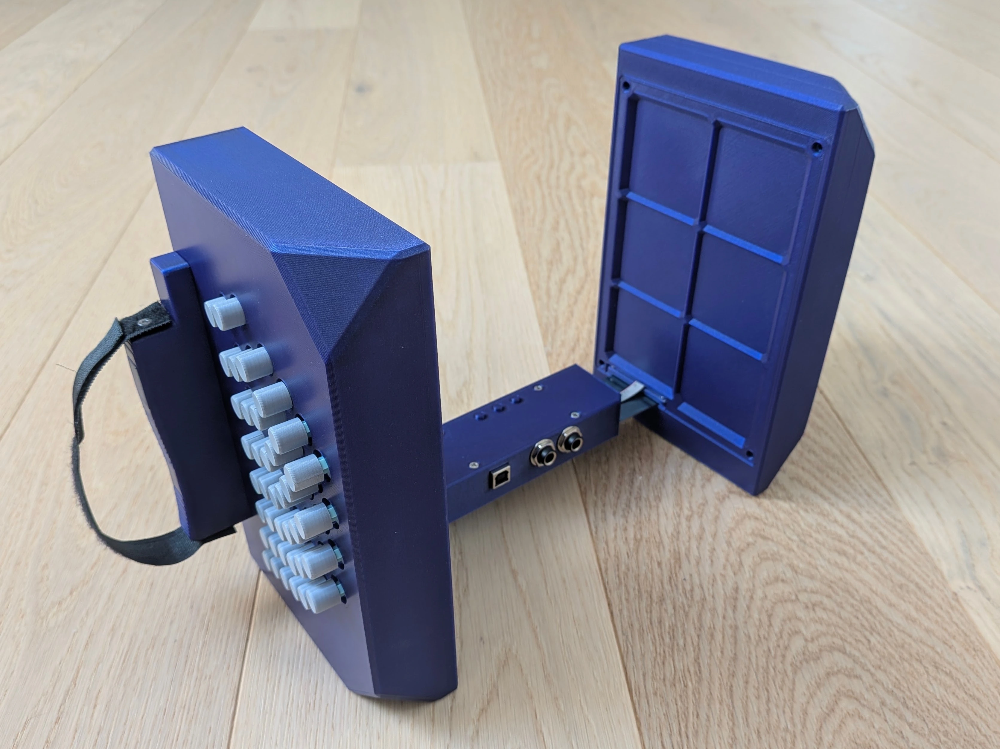
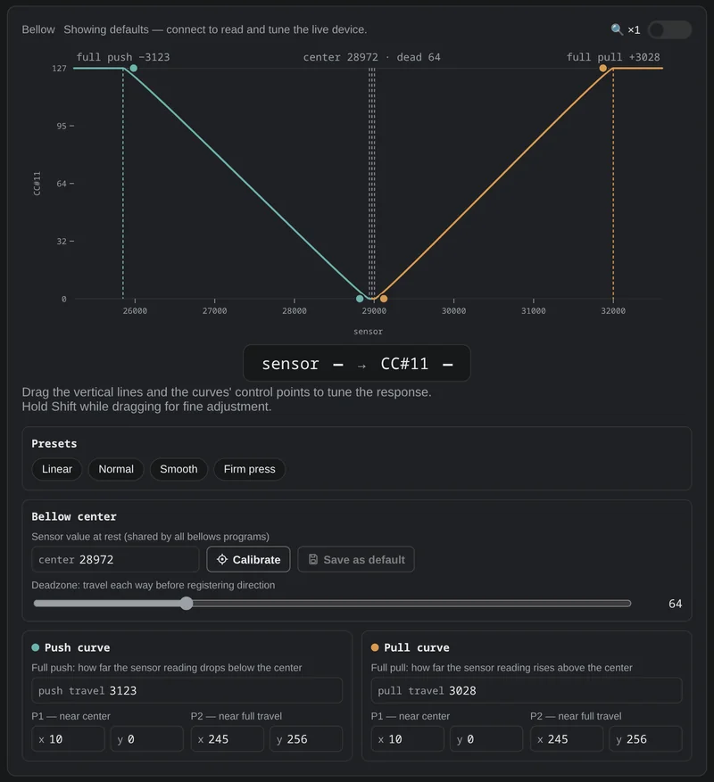
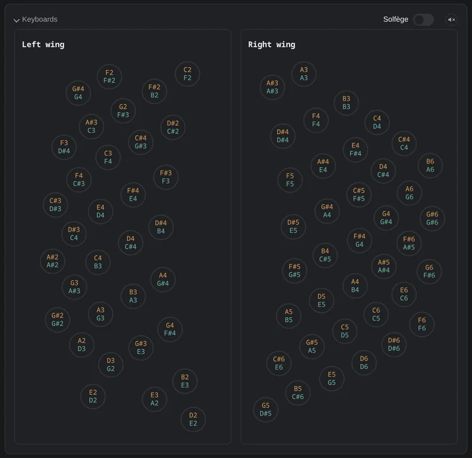
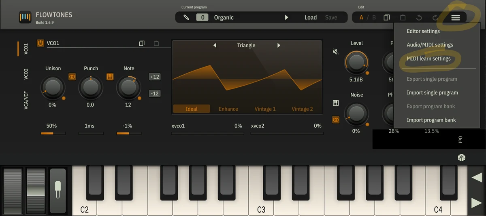
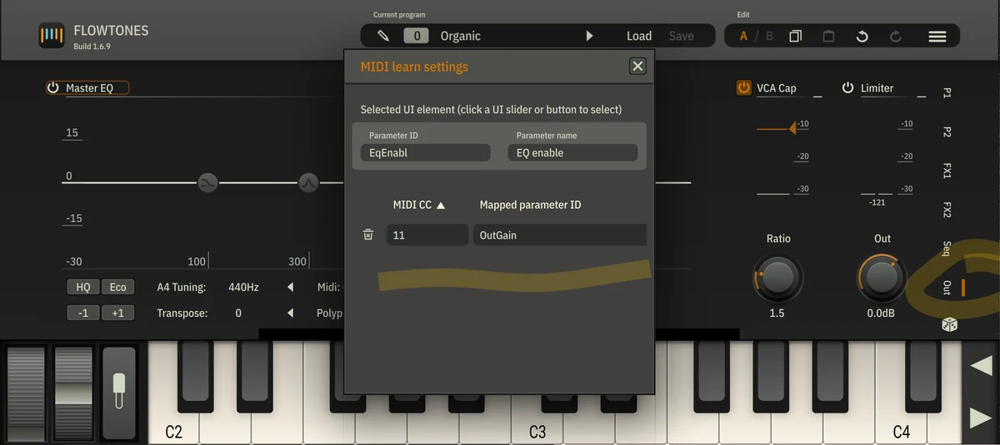

---
---
# Manuel d'utilisation du Bandolibre

🇬🇧 [English](user_manual.md) | 🇫🇷 **Français** | 🇪🇸 [Español](user_manual.es.md)

Ce manuel s'adresse aux musiciens. Il explique comment brancher le Bandolibre,
configurer votre logiciel de musique, utiliser les boutons de fonction et les
pédales, régler le toucher du soufflet et mettre à jour le firmware. Aucun
outil ni connaissance technique n'est nécessaire.

---

## Un instrument partagé

Le Bandolibre est publié sous licence
[CC BY-NC-SA 4.0](https://creativecommons.org/licenses/by-nc-sa/4.0/deed.fr) :
vous êtes libre de le construire, le réparer, le modifier et le partager, dans
un cadre non commercial.

Il existe grâce à des personnes qui ont donné librement leur temps et leur
savoir, dans l'esprit de
[L'Atelier du bandonéon libre](https://bandolibre.github.io). Faites-en bon
usage : jouez, enseignez, expérimentez. Et si vous le pouvez, transmettez à
votre tour : partagez ce que vous apprenez, aidez quelqu'un à construire le
sien ou contribuez au projet, pour que cette chaîne de générosité continue de
grandir.

---

## Présentation

Le Bandolibre est un contrôleur MIDI en forme de bandonéon argentin. Il ne
produit aucun son lui-même : il envoie votre jeu à un ordinateur, une tablette
ou un téléphone, où un instrument virtuel le transforme en son.

- **Deux claviers**, main gauche et main droite, avec la disposition
  Rheinische Tonlage à 142 tons.
- **Soufflet** : une lame-ressort entre les deux mains. Elle mesure la force
  avec laquelle vous poussez ou tirez, comme réagirait un vrai soufflet.
- **Trois boutons de fonction** sur le module principal : gauche, milieu et
  droite.
- **Deux entrées pédale** (jacks 6,35 mm) pour pédales d'expression.
- **Un port USB Type-B**, pour l'alimentation et le MIDI.

---

## Prise en main de votre instrument

Deux Bandolibre ne sortent jamais de l'atelier tout à fait identiques : les
aimants ne sont jamais exactement pareils, et la géométrie varie légèrement d'un
instrument à l'autre. Pour qu'une note ne sonne que lorsque vous poussez ou tirez, l'instrument doit
savoir où se trouve le soufflet au repos.
[Calibrez le soufflet](#calibrage-du-soufflet) avant la première utilisation
de votre instrument.

---

## Branchement

Branchez le Bandolibre à votre ordinateur, tablette ou téléphone avec un câble
USB Type-B. Ce seul câble alimente l'instrument et transporte le MIDI. Pas de
batterie, d'adaptateur secteur ni de pilote.

Il apparaît comme un périphérique MIDI nommé **Bandolibre**.

---

## Configurer votre logiciel

Dans votre logiciel de musique (DAW), de notation ou votre application de
synthé, sélectionnez **Bandolibre** comme entrée MIDI.

- La **main gauche** joue sur le **canal MIDI 1**, la **main droite** sur le
  **canal 2**. Vous pouvez donner à chaque main son propre instrument, ou
  envoyer les deux canaux vers le même.
- Le soufflet envoie le **CC#11 (Expression)** sur les deux canaux, en continu
  pendant le jeu. Il fixe aussi la **vélocité** de chaque note : plus vous
  poussez ou tirez fort en appuyant sur une touche, plus la vélocité est
  élevée.
- La pédale 1 envoie le **CC#1 (Modulation)** et la pédale 2 le
  **CC#4 (Foot Controller)**, également sur les deux canaux.

---

## Boutons de fonction

### Bouton gauche : système de clavier

Appuyez sur le **bouton gauche** pour passer d'un système de clavier à l'autre :

| Système | Poussé et tiré |
|---|---|
| **Rheinische Tonlage** (par défaut) | Notes différentes (bisonore), le bandonéon argentin |
| **Peguri** | Même note dans les deux sens (unisonore) |
| **Manoury** | Même note dans les deux sens (unisonore) |

Après Manoury, il revient à la Rheinische Tonlage.

### Bouton du milieu : programme de soufflet

Appuyez sur le **bouton du milieu** pour passer d'un programme de soufflet à
l'autre : **1 → 2 → 3**, puis retour à 1.

Chaque programme a ses propres réglages du soufflet : course du soufflet avant
qu'une note sonne, et façon dont votre effort se traduit en volume. Vous pouvez
régler chacun d'eux dans l'outil de configuration. Par défaut, les programmes 2
et 3 atteignent le volume maximal avec moins d'effort sur le soufflet que le
programme 1. Utiles pour jouer doucement, ou si la lame-ressort vous semble
trop raide. Le programme de soufflet n'a pas d'effet en mode table.

Maintenez le **bouton du milieu** une seconde pour calibrer plutôt la position
de repos du soufflet : voir [Calibrage du soufflet](#calibrage-du-soufflet).

### Bouton droit : mode table

Appuyez sur le **bouton droit** pour activer ou désactiver le mode table.

En mode table, vous pouvez jouer avec l'instrument posé à plat sur une table.
Chaque touche sonne dès que vous l'enfoncez, sans pousser ni tirer le soufflet.
Chaque touche joue sa note **tirée**, et toutes les notes sonnent au même
volume.

C'est pratique pour saisir une partition note par note dans un logiciel de
notation. Appuyez à nouveau pour revenir au jeu normal.

---

## Pédales

Vous pouvez brancher jusqu'à deux pédales d'expression de type M-Audio EX-P.
Si votre pédale a un sélecteur de mode, placez-le sur **M-Audio**.

- La **pédale 1** envoie le **CC#1 (Modulation)**.
- La **pédale 2** envoie le **CC#4 (Foot Controller)**.

La plupart des instruments réagissent déjà à ces contrôleurs. Dans votre
logiciel, vous pouvez aussi utiliser le MIDI learn pour associer une pédale à
n'importe quel autre paramètre.

Si une pédale ne couvre pas toute sa course, ou n'atteint jamais zéro,
calibrez-la dans l'[outil de configuration](#outil-de-configuration).

---

## Outil de configuration

L'outil de configuration est une page web qui affiche et modifie les réglages
de l'instrument en USB-MIDI. Il n'y a rien à installer.

Il fonctionne dans les navigateurs compatibles Web MIDI, comme Chrome ou Edge,
sur ordinateur ou sur téléphone et tablette Android. Il ne fonctionne pas sur
iPhone ni iPad.

Il vous permet de :

- **régler le soufflet** : déplacez les courbes de poussé et de tiré, ou
  choisissez un préréglage, pour définir comment votre effort se traduit en
  volume ;
- [**calibrer la position de repos**](#calibrage-du-soufflet) du soufflet ;
- **calibrer les pédales** ;
- changer le système de clavier, le programme de soufflet et le mode table ;
- voir les deux claviers en direct pendant le jeu ;
- **enregistrer vos réglages**, pour que l'instrument les garde une fois
  débranché.

Les changements s'appliquent immédiatement : vous pouvez ajuster le toucher
tout en jouant.

  
  

Vous pouvez aussi l'installer comme une application, qui s'ouvre depuis sa
propre icône :

- **Android** : dans Chrome, ouvrez le menu ⋮ et choisissez **Ajouter à l'écran
  d'accueil**.
- **iPhone ou iPad** : dans Safari, touchez **Partager**, puis **Sur l'écran
  d'accueil**. Elle s'installe, mais ne peut pas communiquer avec l'instrument
  tant qu'Apple ne prend pas en charge Web MIDI.
- **Ordinateur** : dans Chrome ou Edge, cliquez sur l'icône d'installation à
  droite de la barre d'adresse.

---

## Enregistrer vos réglages

Les changements faits dans l'outil de configuration s'appliquent tout de suite,
mais le Bandolibre les oublie quand vous le débranchez, sauf si vous les
enregistrez. Réglez l'instrument comme vous le souhaitez, puis cliquez sur
**Save as default** : le Bandolibre démarre avec ces réglages à chaque
branchement. Cela comprend les réglages du soufflet et des pédales, ainsi que le
système de clavier et le programme de soufflet choisis avec les boutons. Le
mode table est toujours désactivé au démarrage.

Dans la liste des réglages de l'outil, les valeurs enregistrées sont mises en
évidence ; survolez-en une pour voir la valeur d'usine. Mettre à jour le
firmware conserve vos réglages enregistrés.

Pour revenir aux réglages d'origine de l'instrument, ouvrez le menu **⋮**
au-dessus de la liste des réglages et choisissez **Factory reset**.

Le même menu conserve vos réglages dans un fichier : **Save to file** les
télécharge, **Load from file** les rétablit, par exemple après un retour aux
réglages d'usine ou sur un autre Bandolibre. Les réglages chargés s'appliquent
tout de suite ; cliquez sur **Save as default** pour les garder.

---

## Calibrage du soufflet

Le Bandolibre doit connaître la position de repos du soufflet, pour qu'une note
ne sonne que lorsque vous poussez ou tirez. Calibrez-la avant la première
utilisation de votre instrument, puis chaque fois que des notes sonnent alors
que le soufflet est au repos. Il y a deux façons de faire, qui mesurent toutes
deux le soufflet pendant une seconde. Dans les deux cas, posez d'abord
l'instrument à plat sur une table et lâchez le soufflet.

### Avec le bouton du milieu

- Appuyez sur le **bouton du milieu** avec l'index, le pouce sous le module
  principal, pour que l'appui ne pousse ni ne tire le soufflet.
- Maintenez le bouton une seconde, jusqu'à ce que son voyant s'allume.
- Gardez le bouton enfoncé sans bouger jusqu'à ce que le voyant s'éteigne, une
  seconde plus tard.
- La nouvelle position de repos est enregistrée : l'instrument la garde une
  fois débranché.

Cette méthode ne demande pas d'ordinateur.

### Avec l'outil de configuration

- Branchez l'instrument et ouvrez
  l'[outil de configuration](#outil-de-configuration).
- Dans la partie soufflet, sous **Bellow center**, cliquez sur **Calibrate**.
  Ne touchez pas l'instrument pendant une seconde.
- Cliquez sur **Save as default** juste à côté, pour que l'instrument garde la
  nouvelle position de repos une fois débranché.

---

## Produire du son

Le Bandolibre a besoin d'un instrument virtuel pour produire du son. Quel que
soit votre choix :

- choisissez un instrument qui réagit au **CC#11**, sinon le soufflet n'a
  aucun effet sur le son ;
- réglez-le pour écouter les **canaux 1 et 2** (ou tous les canaux), sinon une
  main reste muette.

Pour s'exercer, une simple soundfont de bandonéon suffit :
[European Bandoneon V2.5](https://musical-artifacts.com/artifacts/1862) de Jörg
Bleymehl donne de bons résultats et fonctionne sur tous les appareils
ci-dessous.

### Sur ordinateur

Utilisez un logiciel de musique (Reaper, Ableton Live, Logic, Cubase…) ou de
notation, et chargez un instrument virtuel sur l'entrée MIDI du Bandolibre.

- Les instruments **SWAM** à modélisation physique
  d'[Audio Modeling](https://audiomodeling.com/) donnent les résultats les plus
  expressifs : le soufflet pilote le son lui-même, pas seulement son volume.
- [Native Instruments Session Strings](https://www.native-instruments.com/en/products/komplete/cinematic/session-strings-2)
  fonctionne aussi très bien.

### Sur téléphone ou tablette Android

Utilisez l'application [**FlowTones**](https://play.google.com/store/apps/details?id=com.toneboosters.flowtonesedit) :

1. Branchez le Bandolibre et ouvrez FlowTones.
2. Choisissez un programme avec **Load**. Les sons d'orgue fonctionnent plutôt
   bien.
3. Reliez le soufflet au volume par **MIDI learn** :
   1. Ouvrez le menu **☰** en haut à droite et choisissez **MIDI learn
      settings**.

      

   2. La fenêtre MIDI learn ouverte, touchez l'onglet **Out** sur le bord
      droit de l'écran pour afficher le panneau de sortie.
   3. Touchez le bouton de volume **Out**, puis poussez ou tirez le soufflet.
      Une nouvelle ligne apparaît dans la fenêtre : CC MIDI **11**, associé à
      **OutGain**.

      

   4. Fermez la fenêtre. Le bouton de volume suit désormais le soufflet, et le
      soufflet façonne le volume de chaque note.

### Sur iPhone ou iPad

Le Bandolibre fonctionne avec l'application gratuite
[**GarageBand**](https://apps.apple.com/app/garageband/id408709785) d'Apple :
branchez-le, ouvrez GarageBand et jouez l'un de ses instruments.

Les [instruments **SWAM**](https://audiomodeling.com/iosproducts) existent
aussi pour iPhone et iPad. Ils fonctionnent seuls ou dans GarageBand comme
module (Audio Unit).

### Partagez vos découvertes

Trouver de bons sons pour le Bandolibre reste une question ouverte, et ce que
vous découvrez nous intéresse beaucoup. Si une application, un instrument, une
soundfont ou un réglage vous convient, ou non, tenez-nous au courant à
[bandolibre@googlegroups.com](mailto:bandolibre@googlegroups.com).

---

## Mettre à jour le firmware

Le firmware est le logiciel intégré à l'instrument. Vous le mettez à jour par
le même câble USB, sans outil ni logiciel supplémentaire.

1. Téléchargez le dernier `main-g474.uf2` depuis la
   [page des versions](https://github.com/bandolibre/bandolibre/releases).
2. Débranchez le Bandolibre.
3. Maintenez le **bouton de fonction gauche** enfoncé et rebranchez le câble.
   Gardez-le enfoncé jusqu'à l'apparition d'un lecteur.
4. Un lecteur nommé **BANDOLIBRE** apparaît, comme une clé USB. Le voyant
   au-dessus du bouton gauche clignote lentement pendant l'attente.
5. Copiez `main-g474.uf2` sur ce lecteur.
6. Le voyant clignote plus vite pendant la copie, puis reste allumé environ une
   seconde. Le lecteur disparaît alors et le Bandolibre redémarre avec le
   nouveau firmware.

Le lecteur sert uniquement à recevoir le firmware ; les fichiers copiés dessus
n'y restent pas.

### En cas de problème

- **La copie a été interrompue, ou le câble s'est débranché.** Rien n'est
  endommagé : le nouveau firmware n'est installé qu'une fois le fichier reçu en
  entier. Recommencez à l'étape 2.
- **Le lecteur BANDOLIBRE apparaît sans que vous teniez le bouton gauche.**
  L'instrument n'a trouvé aucun firmware valide et en attend un. Copiez à
  nouveau le fichier `.uf2`.
- **Rien ne se passe lors de la copie.** Vérifiez qu'il s'agit bien du fichier
  `main-g474.uf2` de la page des versions. Tout autre fichier est ignoré : un
  mauvais fichier ne peut pas endommager l'instrument.
- **Le lecteur n'apparaît pas.** Maintenez le bouton gauche *avant* de brancher
  le câble, et gardez-le enfoncé une ou deux secondes après.

---

## Dépannage

**Aucun son**
- Vérifiez que **Bandolibre** est sélectionné comme entrée MIDI dans votre
  logiciel.
- Vérifiez que l'instrument écoute le canal 1 (main gauche) et le canal 2 (main
  droite), ou tous les canaux.
- Poussez ou tirez le soufflet en appuyant sur une touche, ou activez le mode
  table (bouton droit).
- Vérifiez que votre instrument réagit au CC#11 : certains restent muets tant
  que le CC#11 est à 0.

**Une note continue de sonner après avoir relâché la touche**
- Débranchez et rebranchez le Bandolibre. La plupart des logiciels coupent
  aussi d'eux-mêmes les notes bloquées quand l'instrument est déconnecté.

---

## Obtenir de l'aide

Des questions, des problèmes ou des idées ? Écrivez à l'association :

Pour être prévenu quand des cartes, des kits ou des instruments finis seront
disponibles :

---

Pour un usage commercial, contactez l'association à
[bandolibre@googlegroups.com](mailto:bandolibre@googlegroups.com).
