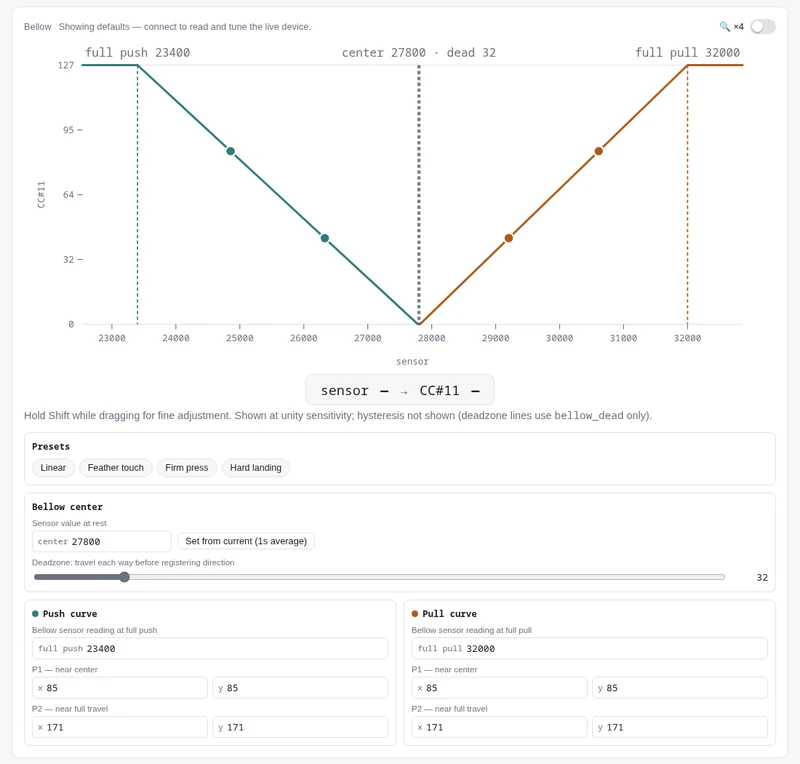
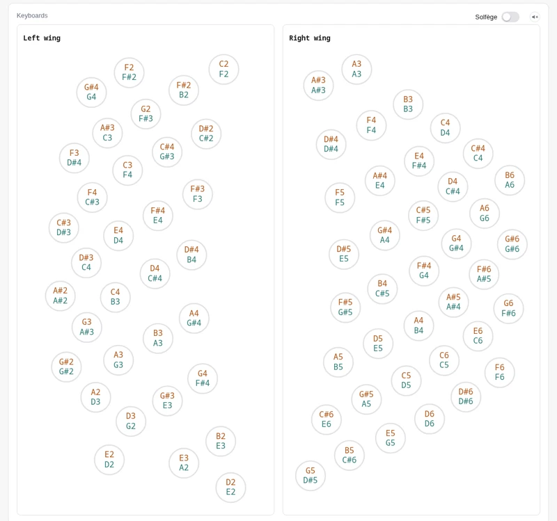

🇬🇧 [English](user_manual.md) | 🇫🇷 [Français](user_manual.fr.md) | 🇪🇸 **Español**

# Manual de usuario del Bandolibre

Este manual es para músicos. Explica cómo conectar el Bandolibre, configurar
tu software musical, usar los botones de función y los pedales, ajustar el
tacto del fuelle y actualizar el firmware. No hacen falta herramientas ni
conocimientos técnicos.

---

## Un instrumento compartido

El Bandolibre se publica bajo la licencia
[CC BY-NC-SA 4.0](https://creativecommons.org/licenses/by-nc-sa/4.0/deed.es):
eres libre de construirlo, repararlo, modificarlo y compartirlo, con fines no
comerciales.

Existe gracias a personas que dieron libremente su tiempo y su conocimiento,
con el espíritu de
[L'Atelier du bandonéon libre](https://bandolibre.github.io). Dale un buen uso:
toca, enseña, experimenta. Y si puedes, pásalo: comparte lo que aprendas, ayuda
a alguien a construir el suyo o contribuye al proyecto, para que esta cadena de
generosidad siga creciendo.

---

## Presentación

El Bandolibre es un controlador MIDI con forma de bandoneón argentino. No
produce sonido por sí mismo: envía lo que tocas a un ordenador, tableta o
teléfono, donde un instrumento virtual lo convierte en sonido.

- **Dos teclados**, mano izquierda y mano derecha, con la disposición
  Rheinische Tonlage de 142 tonos.
- **Fuelle**: una lámina de resorte entre las dos manos. Mide la fuerza con la
  que empujas o tiras, como respondería un fuelle real.
- **Tres botones de función** en el módulo principal: izquierdo, central y
  derecho.
- **Dos entradas de pedal** (jacks de 6,35 mm) para pedales de expresión.
- **Un puerto USB Type-B**, para alimentación y MIDI.

---

## Conexión

Conecta el Bandolibre a tu ordenador, tableta o teléfono con un cable USB
Type-B. Ese único cable alimenta el instrumento y transporta el MIDI. Sin
batería, adaptador de corriente ni controladores.

Aparece como un dispositivo MIDI llamado **Bandolibre**.

---

## Configurar tu software

En tu DAW, programa de notación o aplicación de sintetizador, selecciona
**Bandolibre** como entrada MIDI.

- La **mano izquierda** toca en el **canal MIDI 1**, la **mano derecha** en el
  **canal 2**. Puedes dar a cada mano su propio instrumento, o enviar ambos
  canales al mismo.
- El fuelle envía el **CC#11 (Expresión)** en ambos canales, de forma continua
  mientras tocas. También fija la **velocidad** de cada nota: cuanto más fuerte
  empujas o tiras al pulsar una tecla, mayor es la velocidad.
- El pedal 1 envía el **CC#1 (Modulación)** y el pedal 2 el
  **CC#4 (Foot Controller)**, también en ambos canales.

---

## Botones de función

### Botón izquierdo: modo mesa

Pulsa el **botón izquierdo** para activar o desactivar el modo mesa.

En modo mesa puedes tocar con el instrumento apoyado en una mesa. Cada tecla
suena en cuanto la pulsas, sin empujar ni tirar del fuelle. Cada tecla toca su
nota de **tracción**, y todas las notas suenan al mismo volumen.

Es útil para introducir una partitura nota a nota en un programa de notación.
Pulsa de nuevo para volver a tocar normalmente.

### Botón central: sensibilidad del fuelle

Pulsa el **botón central** para pasar por tres niveles de sensibilidad:
**baja → media → alta**, y de nuevo baja.

En un nivel más alto, alcanzas el volumen máximo con menos esfuerzo del fuelle.
Úsalo para practicar en voz baja, o si la lámina de resorte te parece
demasiado dura. La sensibilidad no tiene efecto en modo mesa.

### Botón derecho: afinación

Pulsa el **botón derecho** para pasar por los tres sistemas de teclado:

| Sistema | Empuje y tracción |
|---|---|
| **Rheinische Tonlage** (por defecto) | Notas distintas (bisonórico), el bandoneón argentino |
| **Peguri** | Misma nota en ambos sentidos (unisonórico) |
| **Manoury** | Misma nota en ambos sentidos (unisonórico) |

Después de Manoury vuelve a la Rheinische Tonlage.

---

## Pedales

Puedes conectar hasta dos pedales de expresión del tipo M-Audio EX-P. Si tu
pedal tiene un selector de modo, ponlo en **M-Audio**.

- El **pedal 1** envía el **CC#1 (Modulación)**.
- El **pedal 2** envía el **CC#4 (Foot Controller)**.

La mayoría de los instrumentos ya responden a estos controladores. En tu DAW
también puedes usar MIDI learn para asignar un pedal a cualquier otro
parámetro.

Si un pedal no cubre todo su recorrido, o nunca llega a cero, calíbralo en la
[herramienta de configuración](#herramienta-de-configuración).

---

## Herramienta de configuración

La herramienta de configuración es una página web que muestra y modifica los
ajustes del instrumento por USB-MIDI. No hay nada que instalar.

Funciona en navegadores compatibles con Web MIDI, como Chrome o Edge, en
ordenador o en teléfono y tableta Android. No funciona en iPhone ni iPad.

Con ella puedes:

- **ajustar el fuelle**: arrastra las curvas de empuje y tracción, o elige un
  ajuste predefinido, para definir cómo tu esfuerzo se convierte en volumen;
- **calibrar la posición de reposo** del fuelle;
- **calibrar los pedales**;
- cambiar la afinación, la sensibilidad y el modo mesa;
- ver ambos teclados en vivo mientras tocas.

Los cambios se aplican al instante, así que puedes ajustar el tacto mientras
tocas.

  
  

También puedes instalarla como una aplicación, que se abre desde su propio
icono:

- **Android**: en Chrome, abre el menú ⋮ y elige **Añadir a pantalla de
  inicio**.
- **iPhone o iPad**: en Safari, toca **Compartir** y luego **Añadir a pantalla
  de inicio**. Se instala, pero no puede comunicarse con el instrumento hasta
  que Apple admita Web MIDI.
- **Ordenador**: en Chrome o Edge, haz clic en el icono de instalación a la
  derecha de la barra de direcciones.

---

## Los ajustes se pierden al desconectar

El Bandolibre aún no recuerda sus ajustes. Al desconectarlo, vuelve a sus
valores por defecto: afinación Rheinische Tonlage, sensibilidad baja, modo mesa
desactivado, y los ajustes por defecto del fuelle y los pedales.

Si ajustaste el fuelle o los pedales en la herramienta de configuración,
tendrás que hacerlo de nuevo al reconectar.

Una próxima actualización del firmware permitirá al Bandolibre recordar sus
ajustes. ¡Permanece atento!

---

## Producir sonido

El Bandolibre necesita un instrumento virtual para producir sonido. Uses lo
que uses:

- elige un instrumento que responda al **CC#11**, si no el fuelle no tiene
  efecto sobre el sonido;
- haz que escuche los **canales 1 y 2** (o todos los canales), si no una mano
  queda en silencio.

Para practicar, basta una simple soundfont de bandoneón:
[European Bandoneon V2.5](https://musical-artifacts.com/artifacts/1862) de Jörg
Bleymehl da buenos resultados y funciona en todos los dispositivos de abajo.

### En ordenador

Usa un DAW (Reaper, Ableton Live, Logic, Cubase…) o un programa de notación, y
carga un instrumento virtual en la entrada MIDI del Bandolibre.

- Los instrumentos **SWAM** de modelado físico de
  [Audio Modeling](https://audiomodeling.com/) dan los resultados más
  expresivos: el fuelle controla el propio sonido, no solo su volumen.
- [Native Instruments Session Strings](https://www.native-instruments.com/en/products/komplete/cinematic/session-strings-2)
  también funciona muy bien.

### En teléfono o tableta Android

Usa la aplicación [**FlowTones**](https://play.google.com/store/apps/details?id=com.toneboosters.flowtonesedit):

1. Conecta el Bandolibre y abre FlowTones.
2. Elige un programa con **Load**. Los sonidos de órgano funcionan bastante
   bien.
3. Vincula el fuelle al volumen con **MIDI learn**:
   1. Abre el menú **☰** arriba a la derecha y elige **MIDI learn settings**.

      

   2. Con la ventana MIDI learn abierta, toca la pestaña **Out** en el borde
      derecho de la pantalla para mostrar el panel de salida.
   3. Toca la perilla de volumen **Out** y luego empuja o tira del fuelle.
      Aparece una nueva línea en la ventana: CC MIDI **11**, asignado a
      **OutGain**.

      

   4. Cierra la ventana. La perilla de volumen ahora sigue al fuelle, y el
      fuelle da forma al volumen de cada nota.

### En iPhone o iPad

El Bandolibre funciona con la aplicación gratuita
[**GarageBand**](https://apps.apple.com/app/garageband/id408709785) de Apple:
conéctalo, abre GarageBand y toca uno de sus instrumentos.

Los [instrumentos **SWAM**](https://audiomodeling.com/iosproducts) también
existen para iPhone y iPad. Funcionan solos o dentro de GarageBand como plugin
(Audio Unit).

### Comparte lo que descubras

Encontrar buenos sonidos para el Bandolibre sigue siendo una cuestión abierta,
y nos interesa mucho lo que descubras. Si una aplicación, un instrumento, una
soundfont o un ajuste te funciona bien, o no, cuéntanoslo en
[bandolibre@googlegroups.com](mailto:bandolibre@googlegroups.com).

---

## Actualizar el firmware

El firmware es el software interno del instrumento. Se actualiza por el mismo
cable USB, sin herramientas ni software adicional.

1. Descarga el último `main-g474.uf2` desde la
   [página de versiones](https://github.com/bandolibre/bandolibre/releases).
2. Desconecta el Bandolibre.
3. Mantén pulsado el **botón de función derecho** y vuelve a conectar el
   cable. Mantenlo pulsado hasta que aparezca una unidad.
4. Aparece una unidad llamada **BANDOLIBRE**, como una memoria USB. La luz
   sobre el botón derecho parpadea lentamente mientras espera.
5. Copia `main-g474.uf2` en esa unidad.
6. La luz parpadea más rápido durante la copia y luego queda encendida
   alrededor de un segundo. La unidad desaparece y el Bandolibre se reinicia
   con el nuevo firmware.

La unidad solo sirve para recibir el firmware; los archivos copiados en ella no
se conservan.

### Si algo sale mal

- **La copia se interrumpió, o se desconectó el cable.** No se daña nada: el
  nuevo firmware solo se instala cuando el archivo ha llegado completo. Vuelve
  a empezar desde el paso 2.
- **La unidad BANDOLIBRE aparece sin que pulses el botón derecho.** El
  instrumento no encontró un firmware válido y espera uno. Copia de nuevo el
  archivo `.uf2`.
- **No pasa nada al copiar el archivo.** Comprueba que sea el archivo
  `main-g474.uf2` de la página de versiones. Cualquier otro archivo se ignora,
  así que un archivo equivocado no puede dañar el instrumento.
- **La unidad no aparece.** Mantén pulsado el botón derecho *antes* de conectar
  el cable, y sigue pulsándolo uno o dos segundos después.

---

## Solución de problemas

**No hay sonido**
- Comprueba que **Bandolibre** esté seleccionado como entrada MIDI en tu
  software.
- Comprueba que el instrumento escuche el canal 1 (mano izquierda) y el canal 2
  (mano derecha), o todos los canales.
- Empuja o tira del fuelle al pulsar una tecla, o activa el modo mesa (botón
  izquierdo).
- Comprueba que tu instrumento responda al CC#11: algunos quedan en silencio
  mientras el CC#11 está en 0.

**Una nota sigue sonando después de soltar la tecla**
- Desconecta y vuelve a conectar el Bandolibre. La mayoría de los programas
  también cortan solos las notas colgadas cuando el instrumento se desconecta.

---

## Obtener ayuda

¿Preguntas, problemas o ideas? Escribe a la asociación:

Para enterarte cuando haya placas, kits o instrumentos terminados disponibles:

---

Para uso comercial, contacta a la asociación en
[bandolibre@googlegroups.com](mailto:bandolibre@googlegroups.com).
